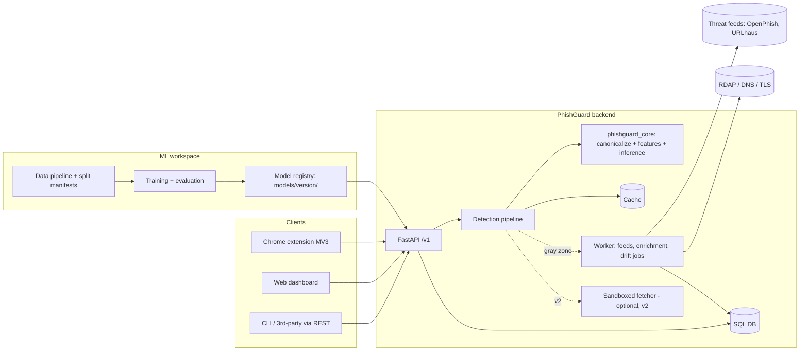
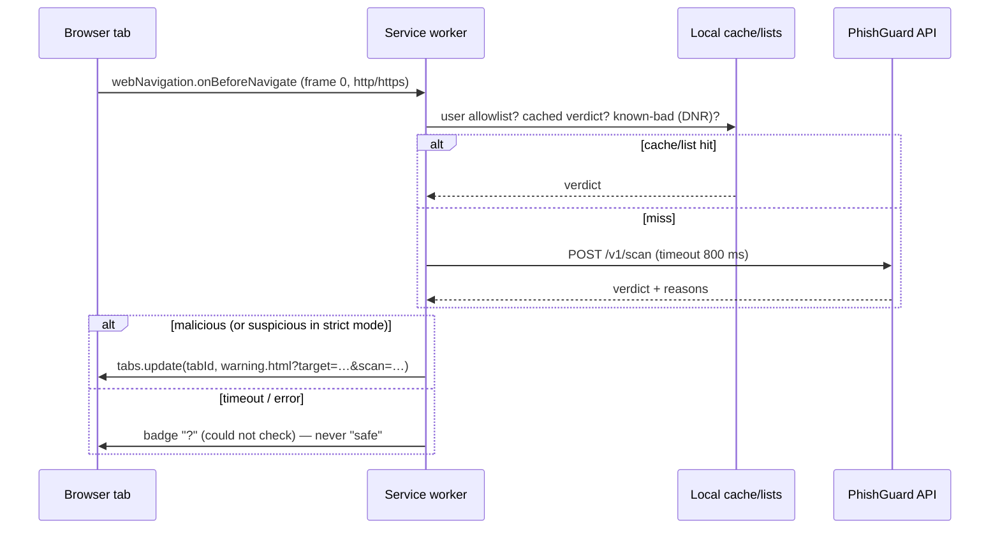

# ARCHITECTURE — PhishGuard AI

Status: Draft v0.1 · Last updated 2026-10-04 · Read with `PRD.md` and `RULES.md`.

---

## 1. Design principles

1. **Layered defense.** No single technique is enough. Lists + ML + (optional) enrichment + (optional) content, fused into one verdict.
2. **URL-first, fetch-never (by default).** The fast path analyzes only the URL string. Anything that touches the network goes through an isolated, time-boxed component.
3. **One feature path.** `phishguard_core` is imported by both training and serving. No re-implementation, no train/serve skew.
4. **Honest evaluation by construction.** Splits, dedupe, and metrics live in code with tests, not in notebooks.
5. **Explain everything.** Each verdict carries machine-readable evidence and human-readable reasons.
6. **Fail safe, never fail "safe".** If we cannot assess, we say `unknown`, never `no_threat_found`.
7. **Privacy by default.** Minimal data, hashed identifiers, optional local-only mode.
8. **Small, boring, replaceable parts.** Every external feed/API sits behind an interface.

## 2. System context



## 3. Components

| Component | Path | Responsibility | Depends on |
|---|---|---|---|
| `phishguard_core` | `core/src/phishguard_core/` | URL parsing/canonicalization, feature extraction, brand/typosquat logic, model loading + inference, reason mapping, defang utils | tldextract, rapidfuzz, lightgbm, onnxruntime |
| ML workspace | `ml/` | Data download/build, dedupe, splits, training, evaluation, robustness suite, export | core, pandas/polars, sklearn, torch, shap |
| Backend API | `backend/app/` | HTTP API, auth, rate limit, pipeline orchestration, persistence | core, FastAPI, SQLAlchemy |
| Worker | `backend/worker/` | Feed sync, enrichment lookups, drift reports, retention cleanup | core, backend db |
| Dashboard | `dashboard/` | Analyst/dev web UI | REST API |
| Extension | `extension/` | Navigation checks, warnings, local lists | REST API (or local model in privacy mode) |
| Sandboxed fetcher (v2) | `backend/fetcher/` | SSRF-safe page fetch, no-JS HTML capture | isolated network egress |
| Infra | `infra/` | Dockerfiles, compose, CI configs | — |

## 4. Detection pipeline

```
 input URL
   │
   ▼
 L0  Validate & canonicalize ──► reject / `unknown` (bad scheme, private/internal host, > max length, parse error)
   │
   ▼
 L1  Allowlist check  ──► curated apex domains only; NEVER for multi-tenant hosts (see §4.2)
   │ (miss)
   ▼
 L2  Denylist / feed check ──► exact URL or host in fresh feeds / user list ⇒ `malicious` (source=feed)
   │ (miss)
   ▼
 L3  Fast ML (URL-only): LightGBM(features) + CharCNN(chars) ⇒ calibrated p
   │     p ≥ T_mal  ⇒ `malicious`
   │     p <  T_sus ⇒ `no_threat_found`
   │     else gray zone
   ▼
 L4  Enrichment (async, time-boxed): RDAP age, DNS, TLS ⇒ enriched model re-score
   │
   ▼
 L5  Content analysis (v2, sandboxed, optional) for still-gray URLs
   │
   ▼
 L6  Fusion & explanation: risk_score, verdict, reasons[], evidence{}
```

### 4.1 Decision rules

- Thresholds `T_sus` and `T_mal` are **loaded from the model's `thresholds.json`**, derived on the validation/calibration split to hit target FPRs (e.g., `T_mal` at FPR ≈ 0.1%, `T_sus` at FPR ≈ 1%). Never hard-code them.
- Feeds and user lists can *raise* a verdict (deny) or *override to allow* only for user-pinned entries. Curated allowlist never overrides a feed hit.
- `unknown` is returned for: non-http(s) schemes, IP literals in private/reserved ranges, `localhost`, intranet single-label hosts, unparseable URLs, URLs over the hard size cap.
- Deep path is only triggered by the gray zone or an explicit `mode=deep` request.

### 4.2 Allowlist and multi-tenant hosting (important)

Attackers host phishing pages on legitimate platforms (document-sharing, site builders, serverless hosting). Treat these as **multi-tenant**:

- Use `tldextract` with **private PSL domains included** so `evil.web.app` and `good.web.app` are different "registered domains".
- Maintain `data/lists/multitenant_hosts.txt` (e.g., `github.io`, `web.app`, `firebaseapp.com`, `pages.dev`, `vercel.app`, `netlify.app`, `blogspot.com`, `sharepoint.com`, `notion.site`, …). Hosts on this list are **never auto-allowed**; they go through ML + feeds with the tenant label as the discriminating part.
- Allowlist = curated apex domains from Tranco top-N **minus** multi-tenant hosts, reviewed manually for the top few thousand.

## 5. Data architecture

### 5.1 Sources and roles

| Source | Use | Label | Notes |
|---|---|---|---|
| PhreshPhish | Train/val/test; temporal benchmark; content features later | `phish`→1, `benign`→0 | Has `url`, `html`, `date`, `target` (brand), `lang`. Use its own temporal split as the reference. |
| PhiUSIIL | Cross-dataset eval only | **`1`=legit → invert** | Use raw `URL`; ignore precomputed content features for URL-only work |
| Tranco | Benign domain pool, allowlist seed, sanity set | benign (weak) | Domains only, no paths → don't build a benign set from bare domains (path-presence shortcut) |
| OpenPhish community | Fresh positives, drift monitoring, denylist | malicious | Live URLs only; non-commercial |
| URLhaus | Optional `malware_distribution` | malicious | Needs `Auth-Key` |

### 5.2 Unified schema (`ml/data/processed/*.parquet`)

| Column | Type | Notes |
|---|---|---|
| `url_raw` | str | Original string |
| `url` | str | Canonicalized |
| `label` | int8 | **1 = malicious, 0 = benign** |
| `source` | str | `phreshphish`, `phiusiil`, `openphish`, … |
| `first_seen` | date | Best available timestamp (dataset date, feed first-seen) |
| `host`, `registered_domain`, `tld` | str | PSL-aware (private domains included) |
| `target_brand` | str? | If provided by source |
| `split` | str | `train` / `val` / `calib` / `test` / `xtest` |
| `url_sha256` | str | Of canonical URL |
| `html_path` | str? | Only for content-feature work (v2) |

### 5.3 Canonicalization (`phishguard_core.url`)

Order matters; implement exactly and test with property-based tests:

1. Strip whitespace/control chars; reject if length > `MAX_URL_LEN` (default 2048 chars, hard cap 8192 for logging).
2. Add `http://` only if scheme is missing *and* input looks like a host (flag `scheme_inferred`).
3. Parse with a strict parser; lower-case scheme and host; remove default ports; remove trailing dot in host.
4. Normalize Unicode host with **NFKC**; detect IDN; compute punycode (`xn--`) form and keep both; flag mixed-script labels.
5. Percent-decode unreserved characters; keep a flag for suspicious double-encoding.
6. Detect userinfo (`user@host`) and flag it; the *real* host is after the last `@` in the authority.
7. Resolve dot-segments in path; drop fragment for scoring (keep flag if fragment contains a URL).
8. Compute `registered_domain`, `subdomain`, `suffix` via PSL (private included).
9. Detect IP-literal hosts (dotted, decimal, hex, octal forms) and normalize.

### 5.4 Splits (the most important design decision)

1. **Deduplicate** on canonical URL; then **near-duplicate removal** (MinHash/LSH over character 5-gram shingles; drop test points with Jaccard ≥ 0.9 vs any train point).
2. **Temporal order:** sort by `first_seen`; train = oldest ~70%, val = next ~10%, calib = next ~10%, test = newest ~10–20%. Prefer the dataset's own temporal split where provided.
3. **Group constraint:** a `registered_domain` appears in exactly one split (assign by first appearance).
4. **Cross-dataset:** `xtest` = a different source entirely (e.g., train on PhreshPhish, test on PhiUSIIL raw URLs).
5. **Save a split manifest** (list of `url_sha256` → split + dataset version hashes). Training refuses to run without it.
6. **Never** fit scalers/encoders/target stats before splitting. Fit on train only.

### 5.5 Dataset-artifact audit (required before modeling)

Compare simple stats by label: has-path rate, https rate, `www` rate, URL length distribution, TLD distribution, trailing-slash rate, digits ratio. Also train three trivial baselines (TLD-only, length-only, has-path-only). If any trivial baseline gets high AUC, the dataset has a shortcut — fix sampling (e.g., add benign URLs with realistic paths) before proceeding. Write `reports/data_audit.md`.

### 5.6 Class balance

Train at a moderate prior (e.g., 1:1 to 1:5) with class weights; **do not** apply SMOTE to URL strings; never resample val/calib/test. Report precision at deployment base rates by reweighting (`precision = TPR·π / (TPR·π + FPR·(1−π))`). Apply prior-shift correction to calibrated probabilities if the deployment prior is known.

## 6. Feature catalogue (`phishguard_core.features`)

Group features by family; every feature has a name, dtype, doc string, and a unit test with a golden example. Missing/unavailable values are `NaN` (trees handle it); never fill with 0 silently.

| Family | Examples |
|---|---|
| **Length & counts** | url_len, host_len, path_len, query_len, n_dots, n_hyphens, n_underscores, n_digits, n_special, n_params, path_depth, n_subdomains |
| **Ratios & entropy** | digit_ratio, letter_ratio, uppercase_ratio, special_ratio, shannon_entropy(url/host/path), longest_token_len, avg_token_len, vowel_ratio |
| **Host structure** | is_ip_host, ip_form (dotted/dec/hex/oct), has_port, nonstandard_port, has_userinfo, is_idn, mixed_script, punycode_labels, tld, tld_risk_prior (train-only stat), is_shortener, label_count |
| **Brand & lookalike** | brand_in_subdomain_not_regdomain, brand_in_path_not_regdomain, edit_distance_to_top_brands (rapidfuzz), homoglyph_skeleton_match, keyboard-typo variants, combosquat (brand + keyword) |
| **Lexical keywords** | hits for login, signin, verify, secure, account, update, confirm, wallet, bank, invoice, payment, password, support (multi-language lists configurable) |
| **Character model prob** | DGA-like randomness: char-bigram log-prob of registered domain under a benign-trained n-gram LM (train-only) |
| **Obfuscation** | pct_encoded_ratio, double_encoding, base64_like_token, hex_blob, `//` in path, `@` in path/query, url-in-query (redirect param), long random subdomain |
| **Enrichment (v1.0, optional)** | domain_age_days, rdap_registrar_known, dns_has_mx, dns_ttl_min, ns_count, tls_cert_age_days, tls_issuer_class, asn_class |
| **Content (v2, optional)** | has_password_input, form_action_offdomain, title_brand_mismatch, favicon_offdomain, ext_link_ratio, hidden_iframe, js_obfuscation_score |

Brand list: seed from PhreshPhish `target` values (most-targeted brands) + manually curated top brands; stored in `data/lists/brands.yaml` with canonical domains. Keep it data, not code.

## 7. Models

| ID | Model | Input | Purpose |
|---|---|---|---|
| M0 | Trivial baselines (TLD-only, length-only) | few features | Detect dataset shortcuts |
| M1 | TF-IDF char n-grams (1–5) + Logistic Regression | raw URL | Strong simple baseline |
| M2 | **LightGBM** | engineered features | Primary tabular model; fast; supports per-request contributions |
| M3 | **Char-CNN** (PyTorch → ONNX) | up to 200 chars | Learns patterns features miss (keyboard walks, homoglyphs) |
| M4 | **Ensemble** of M2 + M3 | probs | Weighted avg or logistic stacking on out-of-fold predictions |
| M5 | Enriched LightGBM | URL feats + enrichment | Gray-zone re-score; NaN-tolerant |
| M6 (stretch) | Small pretrained transformer fine-tuned on URLs | tokens | Compare vs M4; only keep if it adds measurable value at fixed FPR |

**Char-CNN starting point:** embedding(vocab≈128, 32) → parallel Conv1D (k=3,5,7; 128 filters each, ReLU) → global max-pool → concat → dropout 0.3 → dense 128 → dense 1. Pad/truncate to 200. AdamW, early stopping on val PR-AUC, fixed seeds.

**LightGBM starting point:** `num_leaves=63`, `learning_rate=0.05`, `feature_fraction=0.8`, `bagging_fraction=0.8`, early stopping on val; tune with a time-aware search, capped trial count.

**Calibration:** isotonic regression (or Platt) fit on the `calib` split only; stored as JSON (breakpoints), **not pickle**.

**Why not a general LLM as the classifier:** at least one recent study found a general-purpose distilled LLM well behind classical models on this task. LLMs may later help *explain* verdicts, but no URL data goes to a third-party LLM without explicit opt-in.

## 8. Evaluation protocol (code: `ml/src/phishguard_ml/evaluation/`)

For every candidate model, produce `reports/<run_id>/metrics.json` + plots:

1. **Metrics on `test`** (temporal + grouped): ROC-AUC, PR-AUC, recall at FPR ∈ {1%, 0.1%, 0.01%}, F1 at chosen threshold, ECE, Brier. Bootstrap 95% CI (≥1000 resamples).
2. **Base-rate view:** precision/PPV at base rates 0.05%, 0.5%, 5%.
3. **Cross-dataset (`xtest`)** with the same thresholds (no re-tuning).
4. **Popular-site sanity set:** Tranco top-10k homepages + common paths (login, help, search); must produce ~0 `malicious`.
5. **Robustness suite** (perturb *known phishing test URLs*, measure recall drop): homoglyph substitution, subdomain stuffing, brand-in-path, appended file extension, percent-encoding, compound-word splits, added benign tokens, long random subdomains. Report per-perturbation recall.
6. **Error analysis:** top-50 FPs and FNs (defanged), grouped by TLD / brand / hosting platform.
7. **Ablation:** feature families on/off; with/without CNN; with/without enrichment.
8. **Latency profile:** feature extraction time, model time, p50/p95 on a fixed machine.

Acceptance to promote a model: beats previous champion on recall@FPR 0.1% (test) **and** does not regress on cross-dataset, sanity set, or robustness beyond tolerances in `ml/configs/promotion.yaml`.

## 9. Explainability

- **LightGBM:** use native per-row contributions (`pred_contrib=True`) at request time; take top-k positive contributors.
- **Reason templates:** map features → plain text in `core/reasons.yaml`, e.g. `brand_in_subdomain_not_regdomain` → "The name of a well-known brand appears in the address, but the site is not run by that brand." Each reason has `code`, `severity`, `text`, optional `evidence`.
- **Char-CNN:** attribution (occlusion/integrated gradients) is **offline only** for analysis, not in the request path.
- Rule/feed hits always produce their own reasons (`feed_hit:openphish`, `user_denylist`).
- Never claim causal certainty: phrase as "signals that raised the risk".

## 10. Serving architecture

### 10.1 API (`/v1`, JSON, OpenAPI auto-generated)

| Method | Path | Purpose |
|---|---|---|
| POST | `/v1/scan` | Scan one URL |
| POST | `/v1/scan/batch` | Scan ≤100 URLs |
| GET | `/v1/scan/{scan_id}` | Retrieve a result (privacy rules apply) |
| POST | `/v1/feedback` | Submit feedback on a scan |
| GET | `/v1/lists` / POST `/v1/lists` / DELETE `/v1/lists/{id}` | User allow/deny entries |
| GET | `/v1/model/info` | Active model version, metrics summary, thresholds, data manifest hash |
| GET | `/v1/health`, `/v1/ready` | Liveness / readiness |
| GET | `/metrics` | Prometheus metrics (internal) |
| POST | `/v1/admin/feeds/sync` | Trigger feed sync (admin key) |

**Scan request**
```json
{ "url": "hxxps://example[.]com/login", "mode": "fast", "client": "extension/0.1.0", "store": false }
```
(The real request carries the real URL; the defanged form above is for docs only.)

**Scan response**
```json
{
  "scan_id": "b4f1c9e2-…",
  "url_canonical_hash": "sha256:…",
  "registered_domain": "example.com",
  "verdict": "suspicious",
  "risk_score": 64,
  "probability": 0.64,
  "confidence": "medium",
  "reasons": [
    {"code": "brand_in_subdomain_not_regdomain", "severity": "high", "text": "…", "evidence": {"brand": "…"}},
    {"code": "long_random_subdomain", "severity": "medium", "text": "…"}
  ],
  "layers": {"allowlist": "miss", "feeds": "miss", "ml": "scored", "enrichment": "skipped"},
  "model_version": "2026.10.0-m4",
  "latency_ms": 38,
  "cached": false
}
```

**Error model:** RFC 7807 `application/problem+json` with stable `code` values (`invalid_url`, `url_too_long`, `unsupported_scheme`, `rate_limited`, `unauthorized`, `internal`). Never echo the raw URL unescaped in error messages.

### 10.2 Runtime behavior

- Models loaded once at startup from `models/<version>/` after **sha256 verification** against `manifest.json`; hot-swap via `ready` gating; keep previous version for rollback.
- Cache: key = `(model_version, url_sha256)`, TTL 10 min for ML verdicts, shorter for gray zone; feed hits cached until feed TTL.
- Auth: API key header (`X-API-Key`); keys stored hashed. Rate limit per key and per IP.
- All timeouts explicit (DB 2 s, enrichment lookups 1.5 s each, global deep budget 5 s).
- Fast path never blocks on enrichment: gray-zone enrichment runs async; client may poll `GET /v1/scan/{id}` or pass `mode=deep` to wait.

### 10.3 Persistence (SQL)

```
scans(id uuid pk, created_at, url_sha256 char(64), url_stored text null, url_defanged text,
      registered_domain text, verdict text, risk_score int, probability real,
      model_version text, layers_json json, reasons_json json, client text, latency_ms int)
feedback(id uuid pk, scan_id fk, label text check in ('false_positive','false_negative','correct'),
         note text null, created_at, review_status text default 'new')
feed_entries(id pk, source text, url_sha256 char(64), url text, host text, first_seen, last_seen, expires_at, label text)
lists(id pk, owner_key_hash, kind text check in ('allow','deny'), pattern text, scope text, note text, created_at)
model_registry(version pk, created_at, git_sha, data_manifest_hash, metrics_json, thresholds_json, status text)
```

Privacy defaults: `url_stored` is **null** unless `store=true`; when stored, query string and fragment are stripped. `url_sha256` of the canonical URL is always kept for dedupe/cache. Retention job deletes scans older than N days (default 30).

## 11. Chrome extension architecture (Manifest V3)

**Key constraint:** in MV3, ordinary extensions cannot use blocking `webRequest` listeners; network blocking is done with declarative rules (`declarativeNetRequest`). An ML verdict therefore cannot synchronously stop a navigation. Design accordingly.

| Part | Role |
|---|---|
| Service worker (`background.ts`) | Listens to main-frame navigations; consults local state; calls API; triggers warning. **Ephemeral** — keep no in-memory state; use `chrome.storage.session` / `local`. |
| Warning page (`warning.html`) | Interstitial shown when verdict is `malicious` (and optionally `suspicious`). Buttons: Go back, Proceed this once, Always allow this site, Report wrong warning. |
| Popup (`popup.html`) | Status for the current tab, reasons, scan-again, settings link. |
| Options (`options.html`) | API URL/key, privacy mode, strictness, local lists, data deletion. |
| DNR dynamic rules | Pre-emptively redirect/block *known-bad hosts* synced from the denylist (respect dynamic-rule limits; verify in docs). |
| Content script (v2, optional) | Page-level signals (password fields) — only if value is shown by ablation. |

**Flow**


Rules: request only the permissions needed (verify exact set against current Chrome docs at implementation; likely `webNavigation`, `storage`, `declarativeNetRequest`, `tabs`/`activeTab`, and host permission for the API origin only). No remote code. Bundle fonts and assets locally (MV3 CSP). Prepare Chrome Web Store privacy disclosures if publishing.

**Privacy mode:** local lists + on-device ONNX char model/lexical model (size-budgeted, e.g., < 5 MB) via ONNX Runtime Web/WASM; no network calls. Accuracy will be lower; show that in settings.

## 12. Dashboard architecture

React + Vite + TypeScript SPA. Routes: `/scan`, `/scan/:id`, `/history`, `/feedback`, `/model`, `/settings`. API client generated from OpenAPI. All URL strings are rendered as text (never `innerHTML`), defanged by default with an explicit "reveal" control. Design tokens in `DESIGN.md`.

## 13. Security architecture

### 13.1 Threat model (abridged)

| Threat | Vector | Mitigation |
|---|---|---|
| SSRF via scan/fetch | Attacker submits internal/metadata URLs | No fetch on fast path; fetcher blocks private/link-local/loopback/metadata ranges, resolves DNS once and pins IP, re-validates every redirect, http/https only, size/time caps, no cookies, isolated egress |
| Malicious content exploiting fetcher | Crafted HTML/images | Parse in a separate, resource-limited container; no JS execution; no file writes outside tmp |
| XSS / log injection from URL strings | Hostile characters in URLs | Always output-encode; defang in UI/log; structured logging; length caps |
| ReDoS / parser DoS | Pathological URLs | Avoid backtracking-heavy regex; max length; fuzz tests with timeouts |
| API abuse / scraping | Bulk requests | Auth, rate limits, batch caps, per-key quotas |
| Model evasion | Adversarial URLs | Normalization, adversarial augmentation, ensemble, layered signals, robustness tests in CI |
| Data poisoning | Malicious feedback or feed injection | Feedback never auto-trains; human review; feed provenance + TTL; outlier checks |
| Supply chain | Dependencies, model files | Lockfiles, `pip-audit`/`npm audit`, hash-verified model artifacts, no pickle loading from untrusted sources |
| Extension compromise | Over-broad permissions, remote code | Minimal permissions, no remote code, strict CSP, signed releases |
| Privacy leakage | Browsing history to server | Query/fragment stripping, hashing, local mode, retention, opt-in |

### 13.2 Secrets and config

12-factor: config via environment, validated by Pydantic Settings. `.env.example` lists every variable (`DATABASE_URL`, `API_KEYS_SALT`, `OPENPHISH_ENABLED`, `URLHAUS_AUTH_KEY`, `SAFE_BROWSING_API_KEY`, `STORE_URLS_DEFAULT`, `RETENTION_DAYS`, …). Feature flags for every external dependency so the system runs fully offline.

## 14. Observability

- Structured JSON logs (`structlog`), request IDs, defanged URLs only.
- Prometheus: request count/latency histograms, verdict distribution, cache hit rate, feed age, model version gauge, enrichment timeout rate.
- Weekly drift job: PSI per feature vs training distribution; fresh-feed recall check (fraction of new OpenPhish URLs that the deployed model flags); feedback FP/FN rates. Output to `reports/drift/`.

## 15. Deployment

- `infra/docker-compose.yml`: `api`, `worker`, `db` (PostgreSQL), optional `redis`, `dashboard` (static via nginx). Separate `fetcher` service on an isolated network (v2).
- Images: slim Python base, non-root user, read-only filesystem where possible, health checks.
- CI (GitHub Actions): lint → type-check → unit tests → small-fixture training smoke test → build images → dependency audit. Nightly: robustness suite on fixture set.
- Local demo must run with `docker compose up` and a pre-trained model in `models/`.

## 16. Repository layout

```
phishguard/
├── AGENTS.md
├── docs/                      # PRD, ARCHITECTURE, RULES, DESIGN, TASKS, MEMORY (+ reports/)
├── core/                      # phishguard_core (shared lib) + tests
│   └── src/phishguard_core/{url,features,brands,inference,reasons,safety}.py
├── ml/
│   ├── src/phishguard_ml/{data,splits,training,evaluation,robustness,export}/
│   ├── configs/               # experiment + promotion configs (YAML)
│   ├── notebooks/             # exploration only; no logic that isn't in src/
│   └── tests/
├── backend/
│   ├── app/{api,core,pipeline,db,schemas,services}/
│   ├── worker/
│   ├── fetcher/               # v2
│   ├── migrations/            # Alembic
│   └── tests/
├── dashboard/                 # React + Vite + TS
├── extension/                 # MV3 TypeScript
├── data/                      # git-ignored raw/interim/processed + data/lists/ (tracked) + README
├── models/                    # versioned artifacts (git-ignored; manifest tracked)
├── reports/                   # run outputs (tracked summaries only)
├── infra/                     # docker, compose, CI helpers
├── scripts/
├── Makefile
├── pyproject.toml
└── .env.example
```

## 17. Testing strategy

| Level | What | Tooling |
|---|---|---|
| Unit | Canonicalization, each feature, reason mapping, label-polarity conversion | pytest, hypothesis (property tests), golden files |
| Parity | Same URL → identical features in training path and serving path | pytest |
| Data | Split constraints: no domain overlap, no temporal leakage, dedupe holds | pytest on fixtures |
| Model | Smoke-train on a 2k-row fixture; metrics above sanity floor; artifact hash check | pytest, CI |
| Robustness | Perturbation suite thresholds | nightly CI |
| API | Contract (OpenAPI), auth, rate limit, error model, SSRF guard unit tests | pytest, httpx, schemathesis (optional) |
| Load | p95 latency at target RPS | locust |
| Extension | Navigation → warning flow; offline fallback; permissions manifest check | Playwright (persistent context) |
| Security | `pip-audit`, `npm audit`, Bandit, secret scanning | CI |
| Accessibility | axe-core on dashboard and extension pages | CI |

## 18. Extension points (later)

Email/SMS text classifier sharing `phishguard_core.reasons`; headless-browser screenshot + brand similarity; active learning from reviewed feedback; federated/on-device updates; additional feed adapters via `FeedAdapter` interface (`fetch() -> Iterable[FeedEntry]`, `license_ok() -> bool`).
